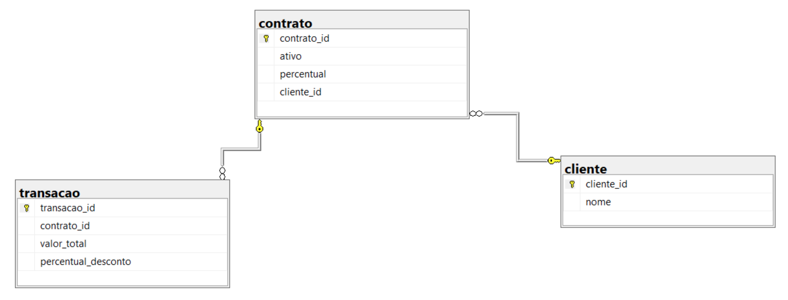
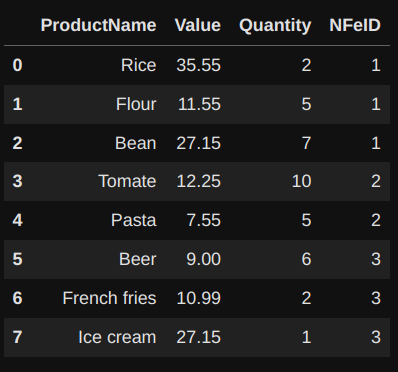
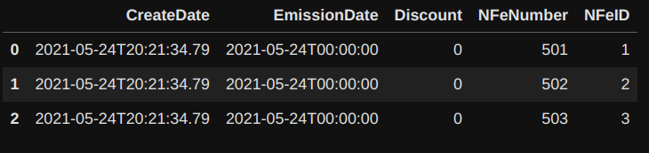
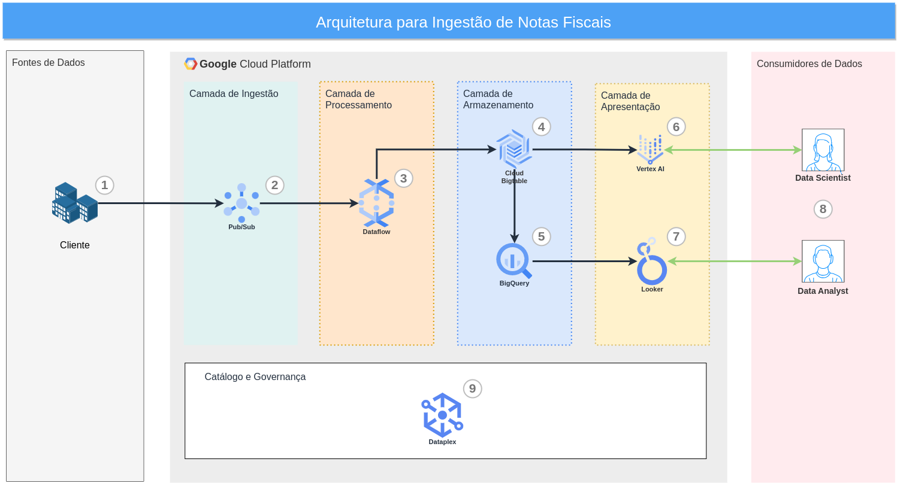

# Teste técnico para vaga de Engenharia de Dados Lambda 3

#### Período de execução do teste
2023-02-06T21:20:00 -> 2023-02-06T23:12:00 (1:52hr)
2023-02-07T22:32:00 -> 2023-02-07T23:38:00 (1:16hr)
2023-02-08T22:22:00 -> 2023-02-09T00:28:00 (2:06hr)
2023-02-09T21:16:00 -> 2023-02-08T21:52:00 (0:26hr)
Período total de execução do teste -> 5:30hr

## Objetivo
Este documento tem como principal objetivo desenvolver a implementação solicitada para a vaga de Engenheiro de Dados da Lambda. As etapas abaixo descritas foram desenvolvidas seguindo as instruções do [repositório original publicado no GitHub](https://github.com/AhirtonLopes/teste_eng_dados).

## Cenário do teste
O texto abaixo é a descrição original do cenário do teste:
```
No seguinte cenário você é a pessoa engenheira de dados por trás do projeto de data ops junto a uma grande operadora de cartões de crédito.

Os dados a serem ingeridos e analisados em nossa plataforma de Big Data são dados de compras (trasacao), documentos (contrato) e dados de compradores (cliente).
```

A seguir seguiremos com as tarefas solicitadas e respectivos entregáveis.

## Primeira tarefa
Nesta primeira etapa o avaliador solicita a criação de uma query que retorne o ganho total da empresa. Nas palavras do avaliador:

_"Escrever uma aplicação para calcular o ganho total da empresa, o qual é obtido a partir da taxa administrativa do serviço de cartão de crédito para seus clientes. Esse ganho é calculado sobre um percentual das transações de cartão de crédito realizadas por eles."_

O schema do banco de dados da empresa é representado pela Figura 1 abaixo.


Figura 1. O schema relacional das tabelas do banco transacional da empresa de cartão de crédito.

### Instalando o Postgres através do Docker
Com intuito de criar um banco de dados relacional de acordo com o enunciado da tarefa iremos utilizar o RDBMS Postgres rodando dentro de um container Docker. Para mais informações de como instalar o Docker acessar o [tutorial oficial](https://docs.docker.com/engine/install/ubuntu/).

```
docker run --name postgres-db -e POSTGRES_PASSWORD=docker -p 5432:5432 -d postgres
```

Com a criação deste container rodando Postgres podemos acessar o banco relacional através de qualquer Client de SQL como o [DBeaver](https://dbeaver.io/download/) ou [Beekeeper](https://www.beekeeperstudio.io/) (usuário `postgres`, senha `docker` na porta `5432` do `localhost` ). Ou também pela ferramenta de linha de comando [psql](https://pgdocptbr.sourceforge.io/pg80/app-psql.html).
```
psql -h localhost -U postgres -d postgres
```

### Criação das tabelas no banco relacional
Em seguida utilizou-se a [query fornecida pelo repositório do teste](https://drive.google.com/file/d/1lqZZb9WgkyyL7qBZ5ZAPENVYoioK2hMs/view), fazendo adaptações para ser executada em um banco Postgres.
```sql
CREATE DATABASE desafio_engenheiro;

\c desafio_engenheiro;

CREATE TABLE cliente (
  cliente_id bigserial PRIMARY KEY,
  nome varchar(30) NOT NULL
);

INSERT INTO cliente (nome) VALUES ('Cliente A');
INSERT INTO cliente (nome) VALUES ('Cliente B');
INSERT INTO cliente (nome) VALUES ('Cliente C');
INSERT INTO cliente (nome) VALUES ('Cliente D');

CREATE TABLE contrato (
  contrato_id bigserial PRIMARY KEY,
  ativo boolean NOT NULL,
  percentual numeric(10,2) NOT NULL,
  cliente_id bigint NOT NULL,
  FOREIGN KEY (cliente_id) REFERENCES cliente(cliente_id)
);

INSERT INTO contrato (ativo, percentual, cliente_id) VALUES (TRUE, 2, 1);
INSERT INTO contrato (ativo, percentual, cliente_id) VALUES (FALSE, 1.95, 1);
INSERT INTO contrato (ativo, percentual, cliente_id) VALUES (TRUE, 1, 2);
INSERT INTO contrato (ativo, percentual, cliente_id) VALUES (TRUE, 3, 4);

CREATE TABLE transacao (
  transacao_id bigserial PRIMARY KEY,
  contrato_id bigint NOT NULL,
  valor_total numeric(10,2) NOT NULL,
  percentual_desconto numeric(10,2) NULL,
  FOREIGN KEY (contrato_id) REFERENCES contrato(contrato_id)
);

INSERT INTO transacao (contrato_id, valor_total, percentual_desconto) VALUES (1, 3000, 6.99);
INSERT INTO transacao (contrato_id, valor_total, percentual_desconto) VALUES (2, 4500, 15);
INSERT INTO transacao (contrato_id, valor_total, percentual_desconto) VALUES (1, 57989, 1.45);
INSERT INTO transacao (contrato_id, valor_total, percentual_desconto) VALUES (4, 1, 0);
INSERT INTO transacao (contrato_id, valor_total, percentual_desconto) VALUES (4, 35, NULL);

```

### Resposta da Primeira Tarefa 
Com as tabelas criadas e dados já inseridos partimos para desenvolver a query que retorne ganho total da empresa.
```sql
select
  nome nome_cliente,
  round(sum(ganho_por_transacao_2), 2) valor
from (
select
  *,
  t.valor_total * (t.percentual_desconto / 100) ganho_por_transacao_1,
  t.valor_total * (ctt.percentual / 100) ganho_por_transacao_2
from
  cliente clt
join 
  contrato ctt
on 
  clt.cliente_id = ctt.cliente_id
join
  transacao t
on
  ctt.contrato_id = t.contrato_id
where
  ctt.ativo) t1
group by 1;
  
```

Resultado da query:

| nome_cliente | valor                       |
| ------------ | --------------------------- |
| Cliente D    | 1.08                        |
| Cliente A    | 1219.78                     |

Ficou um pouco confuso de qual valor de desconto percentual utilizar, o `percentual_desconto` da tabela transacao ou o `percentual` da tabela contrato, de modo que utilizamos a segundo opção. Haveria a necessidade de se pedir uma definição mais detalhada pelo avaliador sobre as definições de regra de negócio do dataset oferecido.

## Segunda Tarefa
Na segunda tarefa exige-se que se calcule o total líquido da empresa (soma do total_bruto menos o desconto_percentual de cada cliente). O dataset a ser utilizado é o seguinte:

```python
transacoes = [
{'transacao_id' : 1, 'total_bruto' : 3000, 'desconto_percentual' : 6.99},
{'transacao_id' : 2, 'total_bruto' : 57989, 'desconto_percentual' : 1.45},
{'transacao_id' : 4, 'total_bruto' : 1, 'desconto_percentual' : None},
{'transacao_id' : 5, 'total_bruto' : 34, 'desconto_percentual' : 0.0},

]
```

A exigência é que este cálculo seja feito utilizando-se PySpark.

### Criando o ambiente de desenvolvimento
Nesta etapa iremos criar um ambiente de desenvolvimento para trabalhar de forma organizada e reprodutível nas tarefas solicitadas no teste.

#### Instalação do Miniconda
O Miniconda é uma ferramenta utilizada na gestão de pacotes e criação de ambientes isolados distribuído pela empresa Anaconda. Para instalá-lo em uma máquina rodando Linux é só executar os seguintes comandos:

```
wget https://repo.continuum.io/miniconda/Miniconda3-latest-Linux-x86_64.sh
chmod +x Miniconda3-latest-Linux-x86_64.sh
./Miniconda3-latest-Linux-x86_64.sh
export PATH=/home/YOURNAME/miniconda3/bin:$PATH
```

Para mais informações sobre como configurar o seu ambiente de desenvolvimento você pode consultar o artigo [Creating a Solid Data Science develpment enviroment (Towards Data Science)](https://towardsdatascience.com/creating-a-solid-data-science-development-environment-60df14ce3a34).


#### Criação do ambiente Conda
Com o Miniconda instalado, iremos criar um ambiente Python isolado para o desenvolvimento das tarefas.

```
conda create -n lambda3_de_test python=3.8
conda activate lambda3_de_test
pip install ipykernel
ipython kernel install --user --name=lambda3_de_test
```

#### Instalação do Spark
O próximo passo é instalar o Open JDK, umas das dependências do Spark.

```
sudo apt install openjdk-8-jdk
```

Em seguida iremos instalar o Pyspark e bibliotecas necessárias para o ambiente de desenvolvimento local em Python.

```
pip install jupyterlab pandas sqlalchemy psycopg2-binary pyspark
```

### Desenvolvendo a solução para a segunda tarefa
Com o ambiente de desenvolvimento pronto, iremos primeiro abrir o Jupyter Lab para desenvolver o código em Pyspark para a solução.

```
jupyter lab
```

O código dos blocos a seguir foram desenvolvidos dentro do Jupyter Lab e foram colados aqui para facilitar a avaliação.

```python
import pandas as pd
from pyspark.sql import SparkSession
from pyspark.sql.functions import expr
from pyspark.sql import functions as F

transacoes = [
{'transacao_id' : 1, 'total_bruto' : 3000, 'desconto_percentual' : 6.99},
{'transacao_id' : 2, 'total_bruto' : 57989, 'desconto_percentual' : 1.45},
{'transacao_id' : 4, 'total_bruto' : 1, 'desconto_percentual' : None},
{'transacao_id' : 5, 'total_bruto' : 34, 'desconto_percentual' : 0.0},
]

spark = SparkSession.builder.appName("ReadDictionary").getOrCreate()

df = pd.DataFrame(transacoes)

```


Nesta primeira etapa foram feitas as importações de bibliotecas para lidar com os dados (Pandas e Pyspark) e definição do dicionário do dataset. Em seguida, instanciou-se a sessão do Spark e criou-se um Dataframe Pandas a partir do dicionário.

```python
spark_df = spark.createDataFrame(df)
spark_df = spark_df.na.fill(0, subset=["desconto_percentual"])
```

No bloco acima criou-se um Spark Dataframe a partir de um Dataframe Pandas e em seguida utilizou-se o método de preenchimento de valores nulos do PySpark na coluna `desconto_percentual`.

```python
spark_df = spark_df.withColumn("gross_profit", expr("total_bruto * ((100 - desconto_percentual) / 100)"))
spark_df.show()
```

```
+------------+-----------+-------------------+------------------+
|transacao_id|total_bruto|desconto_percentual|     total_liquido|
+------------+-----------+-------------------+------------------+
|           1|       3000|               6.99|            2790.3|
|           2|      57989|               1.45|57148.159499999994|
|           4|          1|                0.0|               1.0|
|           5|         34|                0.0|              34.0|
+------------+-----------+-------------------+------------------+
```

Em seguida criou-se a coluna `total_liquido` a partir da regra de negócio definido no enunciado da tarefa.

E finalmente somou-se a coluna criada `total_liquido` para se chegar ao valor pedido.

```python
sum_net_total = spark_df.agg(F.sum(spark_df.total_liquido)).collect()[0][0]
print(sum_net_total)
```

O valor total retornado foi o de:

 ```
 59973.4595
 ```


## Terceira Tarefa
Nesta tarefa foi solicitado a transformação do [arquivo JSON](https://drive.google.com/file/d/1IDCjpDZh5St97jw4K_bAewJ8hf-rax9C/view) em dataframes seguindo as seguintes orientações:

- Expandir a coluna `item_list` num mesmo dataframe;
- Normalizar os itens dessa coluna de dicionário e dividí-los em dois dataframes separados, seguindo o modelo relacional.

A primeira etapa consistiu em salvar o json na pasta datasets do repositório.
As próximas etapas foram desenvolvidas utilizando o Jupyter Lab com as células mais importantes para o desenvolvimento da resposta sendo colados neste documento.

### Desenvolvendo o fluxo para processamento do JSON
A primeira etapa consiste em ler o arquivo JSON fornecido

```python
import pandas as pd
df_task3 = pd.read_json("datasets/dataset_tarefa3.json")
```

Em seguida utilizou-se o método `explode` do Pandas para expandir os dados em estrutura de lista de dicionários na coluna `ItemList`, aumentando o número de linhas do Dataframe de 3 para 8. 

```python
df_exploded_task3 = df_task3.explode('ItemList')
```

Para fazer a conversão dos dados que estão como dicionário na coluna `ItemList` utilizamos o método `pd.json_normalize` e em seguida atribuimos os identificadores correspondentes ao Dataframe resultante.

```python
df_normalized = pd.json_normalize(df_exploded_task3['ItemList'])
df_normalized['NFeID'] = df_exploded_task3['NFeID'].reset_index().drop(columns='index')
df_normalized.head()
```



E finalmente para termos uma estrutura relacional entre os dois Dataframes só precisamos remover a coluna `ItemList` do Dataframe original, podendo se fazer a correlação entre linhas pela coluna `NFeID`.

```python
df_task3_normalized = df_task3.drop(columns='ItemList')
df_task3_normalized.head()
```




## Quarta tarefa
Nesta quarta tarefa o avaliador solicita a construção de uma arquitetura de dados capaz de lidar com a disponibilização de dados de nota fiscal através de uma API. Essa proposta de arquitetura deve atender os seguintes requisitos:
-   Esquemas de fluxo de dados;
-   Descrições de funcionamento (se necessário);
-   Nomes de tecnologias em ecossistema GCP (serviços, conectores, bibliotecas e módulos).

### Arquitetura de Dados
A figura abaixo detalha a proposta de arquitetura de Dados para solucionar o problema de ingestão de notas fiscais através de API de forma contínua.




Os parágrafos abaixo irão descrever as ferramentas e processos associados a cada um dos números indicados no diagrama da Arquitura acima.

1. A fonte de Dados consiste de todos os clientes que estarão aptos a emitir notas fiscais. Cada um desses eventos de emissão de uma nota irá fazer uma chamada na API desenvolvida pela empresa responsável pela ingestão desses dados.
2. A camada de ingestão será composta pelo PubSub, um serviço de mensagens em tempo real que irá organizar as chamadas da API em uma fila. 
3. O PubSub apresenta uma fácil integração com o Dataflow, que é um serviço de processamento de Dados baseado em Apache Beam. O Dataflow consegue lidar com cargas de dados tanto em batch, quanto em streaming e é ideal para o nosso cenário de ingestão através do PubSub.
4. A camada de armazenamento de nossa arquitetura será composta de dois serviços. Os dados processados pelo Dataflow serão armazenados no Bigtable, um banco de dados NoSQL do tipo wide-column store, com alta escalabilidade e disponibilidade e baixa latência. 
5. Além do Bigtable também teríamos disponível o Bigquery, um serviço de cloud Datawarehouse, com o propósito de se organizar os dados analíticos da empresa. O Bigquery oferece uma integração com o Bigtable, facilitando a transferência de dados entre serviços.
6. Na camada de apresentação teríamos serviços focados em Data Science como Vertex AI, que iria consultar os dados diretamente do Bigtable (haveria a possibilidade de consulta dos dados também do Bigquery).
7. Para as necessidades de BI utilizaria-se o Looker que se integra facilmente com o Bigquery.
8. Em relação aos consumidores de Dados teríamos principalmente Cientistas de Dados (trabalhando com o Vertex AI) e Analista de Dados (e talvez de negócio), interagindo com o Looker para a geração de análises e Dashboards.
9. Finalmente, um aspecto essencial da arquitetura seria a utilização do Dataplex para Governança e Catálogo de Dados.

De uma forma geral a descrição da Arquitetura de Dados proposta focou nos serviços a serem utilizados e fluxo dos dados a partir da fonte, até seu consumo. Existe espaço ainda para detalhar ainda mais alguns aspectos como orquestração (exemplo Apache Airflow rodando no Cloud Composer), outras ferramentas de transformação (DBT rodando no Bigquery)e bibliotecas de Machine Learning (Tensorflow por exemplo), mas isso iria um pouco além do solicitado pelo avaliador.

## Comentários finais
No geral o teste abordou aspectos importantes da posição de engenheiro de Dados, tanto no aspecto mais teórico, quanto mais prático. E foi de certa forma um teste agradável de se realizar.
A única parte que não ficou muito clara para mim foi a primeira tarefa (Query de SQL), em função da dificuldade de entender a regra de negócio para cálculo de ganho total (mais de uma coluna de desconto presente).


## Referências
1. [Miniconda](https://docs.conda.io/projects/conda/en/latest/user-guide/install/index.html)
2. [Anaconda](https://www.anaconda.com/) 
3. [Creating a Solid Data Science development environment](https://towardsdatascience.com/creating-a-solid-data-science-development-environment-60df14ce3a34)
4. [PubSub](https://cloud.google.com/pubsub?hl=pt-br)
5. [Dataflow](https://cloud.google.com/dataflow?hl=pt-br)
6. [Bigtable](https://cloud.google.com/bigtable?hl=pt-br)
7. [Bigquery](https://cloud.google.com/bigquery?hl=pt-br)
8. [Vertex AI](https://cloud.google.com/vertex-ai?hl=pt-br)
9. [Looker](https://cloud.google.com/looker?hl=pt-br)
10. [Dataplex](https://cloud.google.com/blog/products/data-analytics/introducing-google-cloud-dataplex)


